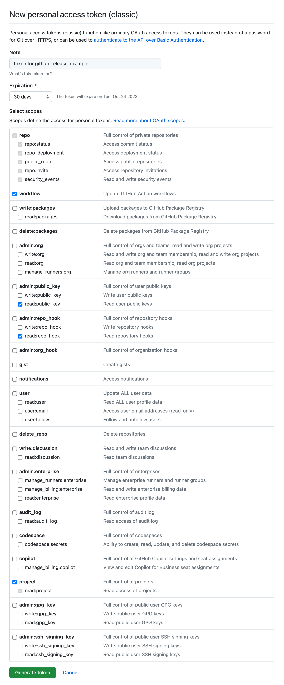
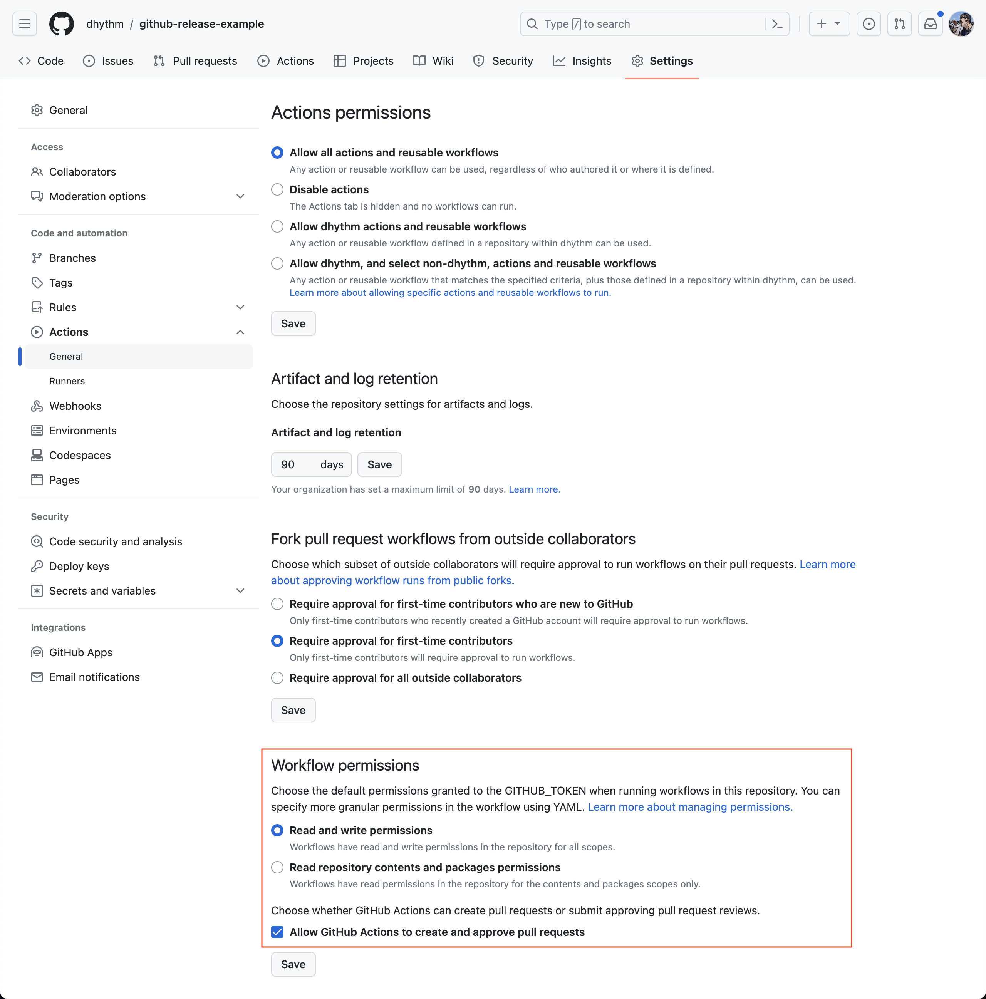
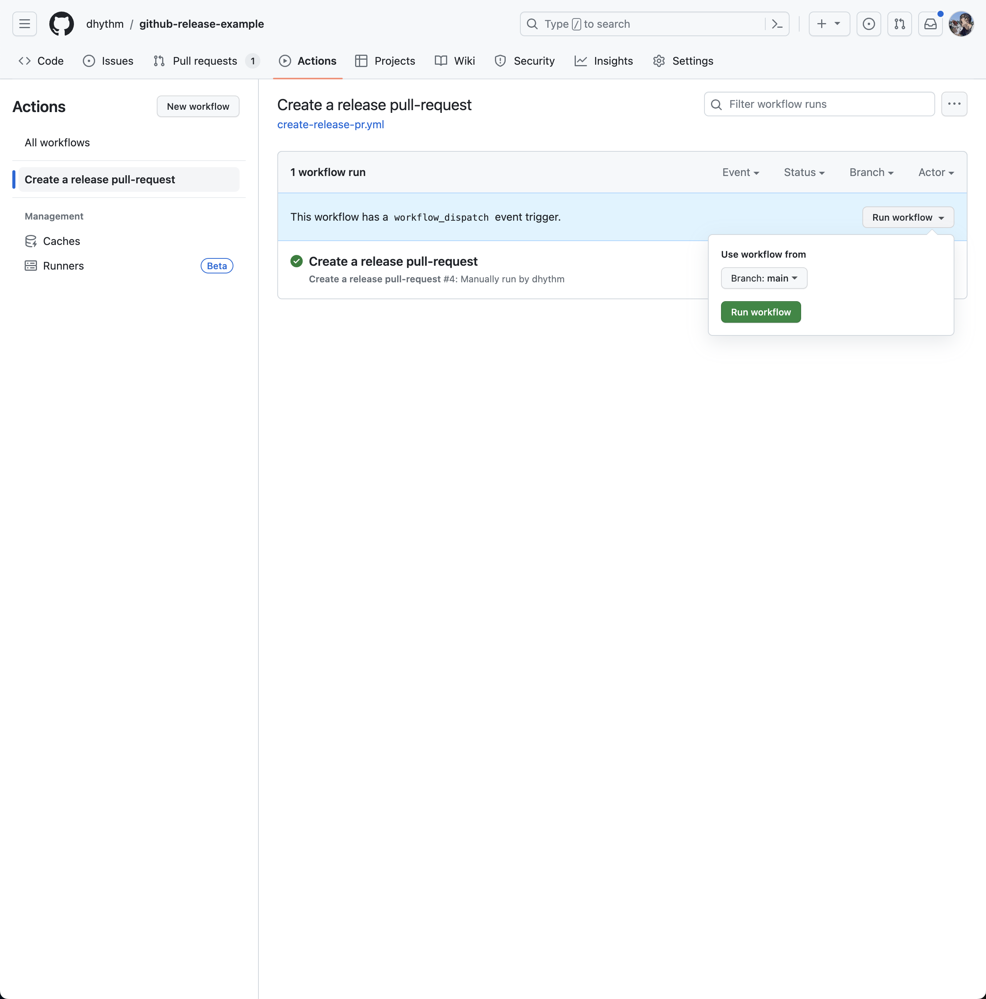
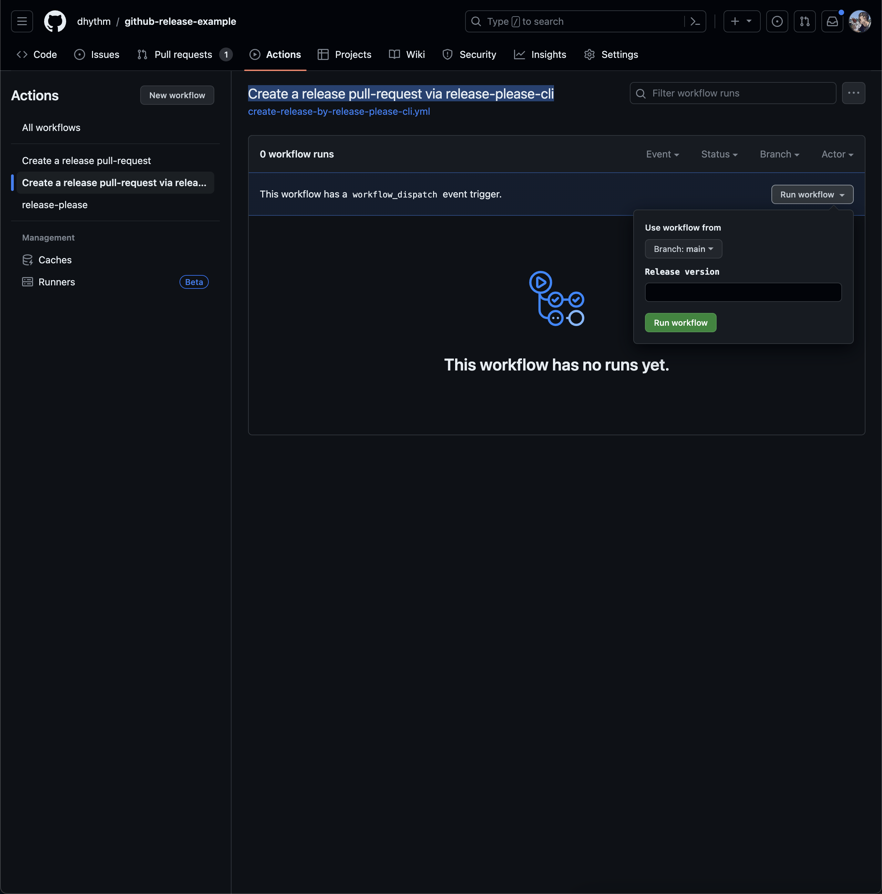

# github-release-example

## Prework

### Install and run Docker

Go to [docker site](https://www.docker.com/) and get docker.
After then, run Docker on your PC.

### Install act

[act](https://github.com/nektos/act) helps developments for GitHub Actions.
Run the following command to install act.

```sh
brew install act
```

### Get GitHub Token for development

Go to `Settings` > `Developper Settings` > `Personal access tokens`, then generate a new token.
The token is used for local debugging, so you have to set expiry and you can delete after debugging.



### Set local environment variables

```sh
export GITHUB_TOKEN=<GITHUB_TOKEN>
export BASE_BRANCH=release
export HEAD_BRANCH=main
export OWNER=dhythm
export REPO=github-release-example
export TEMPLATE=.github/git-pr-release.template
export LABELS=release
```

You can check environment variables by `printenv`.

### Create manifest.json and config for release-please

Run the following command, then release-please will make a PR to add both initial manifest and config.

```sh
npx release-please bootstrap --token=<GITHUB_TOKEN> --repo-url=dhythm/github-release-example --release-type=node
```

## Development

### Debug scripts

Run the following command.

```sh
node .github/src/create_release_pr.js
```

### Debug GitHub Actions

Run the following command.

```sh
act --list --container-architecture linux/amd64
act --secret GITHUB_TOKEN=<GITHUB_TOKEN> -j release_pr --container-architecture linux/amd64
```

The default docker image in `act` doesn't have GitHub CLI (`gh` command).
We can use another image as ubuntu-latest to simulate GitHub Actions with `gh` command like the below.

```sh
act --secret GITHUB_TOKEN=<GITHUB_TOKEN> -j update-release-pr --container-architecture linux/amd64 -P ubuntu-latest=catthehacker/ubuntu:full-latest
```

I recommend to run the command below first, after then run the command the above.
Because the docker image is super big. (about 53GB)

```sh
docker pull catthehacker/ubuntu:full-latest 
```

## Getting started

### Settings

You have to update `Settings` > `Actions` > `General` > `Workflow permissions`.



### Create a merge PR with template

You can run the workflow in `Actions` > `Create a release pull-request` as the following,



### Create a release PR with release-please

You can run the workflow `Create a release pull-request via release-please-cli` as below,



A release PR will be created. github-release will work after the PR is merged.
A release PR is updated if new commit(s) is pushed into main branch before the release-pr is merged.

#### Release with a specific version

[The official doc](https://github.com/googleapis/release-please/blob/main/docs/cli.md) doesn't explain but release-please CLI supports `--release-as` option. See [code](https://github.com/googleapis/release-please/blob/a55a85c2384f088f4a7a71ff8a9d4a3c50789bef/src/bin/release-please.ts#L261).

You can pass a specific version from GitHub Actions workflow.

### Troubleshooting

You can run forcibly github release via the following command,

```sh
npx release-please github-release --token=<GITHUB_TOKEN> --repo-url=dhythm/github-release-example
```

## References

- https://tech.spacely.co.jp/entry/2023/07/26/100915
- https://damienaicheh.github.io/github/actions/2022/01/20/set-dynamic-parameters-github-workflows-en.html
